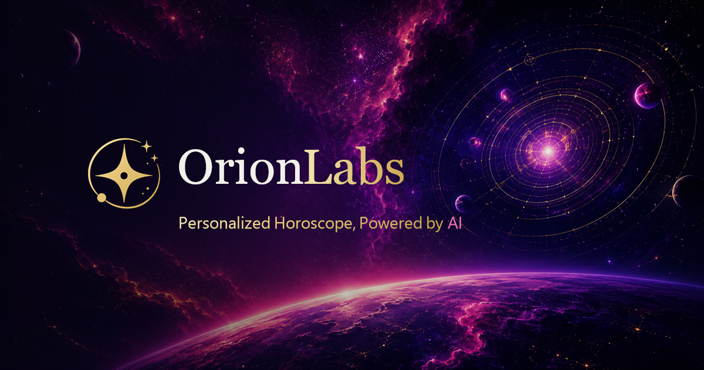

# OrionLabs

OrionLabs is a satirical horoscope experience presented as a polished, venture-backed AI startup. It combines luxury cosmic branding with overconfident claims about proprietary astrological intelligence. The company remains sincere in-universe even when its official language openly acknowledges questionable methodology or lands an obvious joke.

The project is also a portfolio and learning project focused on typed React composition, accessible form controls, secure AI boundaries, runtime validation, route-level state handoff, responsive design, and restrained motion.

## Live demo

[Open OrionLabs](https://orionlabs-ai.vercel.app/)

## Product preview



## Why the project is technically interesting

- Strict server-only Gemini and Groq boundaries keep provider credentials and prompt implementation out of the client bundle.
- Shared Zod schemas validate minimized AI input, structured provider output, and browser persistence at runtime as well as at compile time.
- A responsive React interface combines accessible questionnaire controls, route recovery, reduced-motion behavior, deterministic Subject Signatures, and lazy secondary routes.

## Current status

The landing page, four-step questionnaire, real AI-backed Analysis flow, and personalized report are implemented. The optional context textarea includes a one-click `Enhance with AI` action backed by Groq-hosted `openai/gpt-oss-120b`; the same control supports Undo and the textarea remains the review/edit surface. After review confirmation, the browser creates the approved `ReportGenerationInput` and posts it to a separate server-side Vercel Function. That function validates the input, calls Google Gemini 3.6 Flash, validates the structured `OrionReport`, and returns only a complete report.

The Analysis page keeps its rotating OrionLabs messages as presentation rather than pretending they are real provider stages. Independently, it constructs the deterministic Orion Subject Signature over approximately 16 seconds. It waits for both the request and that minimum loading experience, stores the validated report as an immutable session record, and redirects automatically to `/report`. Failures show an explicit retry action and preserve the questionnaire draft. The local `mockReport` remains available for component development and tests but is no longer the normal completed journey.

The Subject Signature now includes all 12 deterministic zodiac geometries, with hand-tuned focus roles and edge-valid behavior subnetworks. The production report prompts are frozen after controlled-inference calibration; server-side report persistence and account history remain planned.

Route and browser presentation finalization, the full desktop/tablet/mobile UX audit, Cleanup, Accessibility, Performance, and Security are complete. The Production Gemini Firewall rule was externally verified at 5 requests per 60 seconds per IP, with a pre-Function `429` on the sixth request. Accessibility retains documented visual exceptions: certain intentionally muted/supporting text remains below WCAG AA ordinary-text contrast targets, the standard questionnaire option-card selection remains visually color-based, and approved subtle resting control boundaries remain below the 3:1 non-text target. Native radio semantics remain intact, and OrionLabs is not represented as fully WCAG 2.2 AA compliant.

Final Testing / Toolchain Maintenance has completed its repository, dependency, build, mobile-viewport, and Production smoke work. The remaining release evidence is a manual pass on one physical mobile device and one non-Chromium desktop browser; until those are recorded, the repository/toolchain is complete but the final engineering phase remains open.

## Technology

- React 18 and TypeScript
- Vite 6
- Tailwind CSS
- shadcn/ui primitives built on Radix UI
- Framer Motion
- Google Gemini through the official `@google/genai` SDK
- Groq's OpenAI-compatible chat-completions API through server-side `fetch`
- Vercel Functions
- Zod runtime validation and Gemini JSON schema generation
- Vitest 4 focused regression tests

The direct runtime graph is limited to packages used by the current application and server functions. The report flow still does not use a database or account system.

## Application flow

```text
/                  Landing page
/questionnaire     Four questionnaire steps -> review
/calibration       Server-backed report generation or missing-profile recovery
/report            Validated generated report restored from session storage
/research/moon-aware-transformers  Featured research paper
/research/retrograde-aware-distributed-systems  Research paper
/research/astrovector  Research paper
/research/limits-of-science  Research paper
/docs, /press, /legal  Institutional supporting pages
/api/generate-report  Server-side Vercel Function (POST, JSON only)
/api/enhance-context  Server-side optional-context enhancement (POST, JSON only)
```

All other pathnames resolve to the branded 404 page. `/calibration` and the `/research/...` paths above are the implemented routes; `/analysis` is obsolete and receives the same branded 404 as any other invalid pathname. The planned `/articles/...` names in `ROADMAP.md` are not active routes.

Questionnaire progress is saved as a temporary `sessionStorage` draft. Restored drafts must match the exact versioned object shape, configured choices, valid date-input syntax, and the same 80-character name and 600-character context limits enforced later in the journey; malformed or expanded records are removed safely. Context enhancement uses two minimized request shapes: populated context sends only that user-authored text, while empty-context generation sends only focus area and behavioral statement. The Vercel Function reads `GROQ_API_KEY` server-side and makes one Groq request with an 8-second timeout. The returned text becomes the ordinary context answer and carries no AI provenance into report generation.

After review confirmation, `/calibration` maps the draft to name, zodiac sign, calculated age, focus area, behavioral statement, and optional context. Raw birth date and reference preference are not sent to the report function or Gemini. That function reads `GEMINI_API_KEY` only on the server.

Successful reports keep the existing versioned session-storage behavior: the report has a private UUID, the active report pointer is stored separately, and `/report` validates the complete snapshot before rendering. Zodiac, focus, and behavior are stored as application-controlled Subject Signature metadata beside the unchanged AI-facing `OrionReport`; Report never infers behavior from Gemini prose. Starting another analysis clears only the questionnaire draft, so the prior completed report stays active until a validated replacement is persisted. An invalid active record redirects to the questionnaire without displaying mock or partial content.

`vercel.json` provides the SPA fallback needed by the pathname-based routes. Its fallback explicitly excludes `/api/*` and Vite development-resource namespaces so `npx vercel dev` can serve both the frontend development modules and the physical `/api/generate-report` function.

## Codebase overview

```text
api/                    Vercel Function entrypoints
server/                 Server-only Gemini and Groq provider boundaries
tests/                  Focused generation and persistence regression tests
src/
|-- components/         Questionnaire, Analysis, Report, site, and UI components
|-- data/               Questionnaire and report TypeScript contracts/fixtures
|-- hooks/              Presentation timing and shared React hooks
|-- lib/                Validation, generation input, request, and storage boundaries
|-- pages/              Pathname-selected route-level components
|-- App.tsx             Route selection and landing-page composition
|-- main.tsx            React application entry point
`-- index.css           Design tokens, shared effects, and accessibility styles
```

Project direction and constraints are recorded in `PROJECT.md`, `DESIGN_SYSTEM.md`, `ROADMAP.md`, and `HANDOFF.md`.

## Local setup

Use Node.js 20, 22, or 24. The repository declares npm 10.9.9 for repeatable installs and supports npm 10 or newer.

```bash
npm install
```

Create an ignored `.env.local` file from `.env.example` and add development provider keys as needed:

```dotenv
GEMINI_API_KEY=your_development_key
GROQ_API_KEY=your_development_key
VITE_SITE_URL=https://your-production-domain.example
```

`VITE_SITE_URL` is optional locally and contains no secret. Configure it for Preview or Production builds when a stable public origin is available so static canonical and social-image URLs are absolute before React loads. Without it, client-side metadata uses the active browser origin.

Plain `npm run dev` starts Vite but does not execute the `/api` Vercel Function. Use the Vercel development environment for the complete flow:

```bash
npx vercel dev
```

Open the printed local URL and begin at `/questionnaire`. No real key belongs in `.env.example`, source code, browser `import.meta.env`, or a `VITE_`-prefixed variable.

Available checks:

```bash
npm test
npm run typecheck
npm run lint
npm run build
npm run preview
```

Vitest provides focused coverage for questionnaire validation and storage, route recovery, Analysis timing, generation input and schema validation, retries and capacity handling, request de-duplication, report persistence, Subject Signature derivation, landing navigation, research routes, and institutional pages. The tests use fixtures and mocked or injected provider behavior; they do not make real Gemini requests.

## Vercel configuration

In the Vercel project dashboard, add `GEMINI_API_KEY` and `GROQ_API_KEY` under Settings -> Environment Variables for the environments that should use their respective AI features (Development, Preview, and Production as appropriate), then redeploy. Keep both provider values marked sensitive and do not prefix either with `VITE_`. Add the non-secret `VITE_SITE_URL` for environments with a stable public origin so canonical and Open Graph URLs are emitted as absolute URLs.

The repository cannot establish provider billing, quota, retention, logging, account settings, or other dashboard-only state. The configured Vercel Firewall rule for `/api/generate-report` was externally verified at 5 requests per 60 seconds per IP and returned a pre-Function `429` on the sixth request. `/api/enhance-context` intentionally does not share that constrained Gemini bucket and has no dedicated Vercel rate-limit rule under the current Free-plan limit. Its repository controls bound individual requests, but direct automated callers can still repeat them; Groq account-level quota and cost exposure therefore remain accepted operational follow-up items.

`vercel.json` applies `X-Content-Type-Options: nosniff`, `Referrer-Policy: strict-origin-when-cross-origin`, `X-Frame-Options: DENY`, and `Permissions-Policy: camera=(), microphone=(), geolocation=()` to all paths. HSTS and CSP are intentionally deferred until the final production-domain strategy and a compatible staged CSP/reporting approach can be verified.

Server-side TypeScript is executed as Node ESM. Every local runtime import reachable from an `api/` Function therefore uses a relative path with a `.js` extension, which TypeScript maps back to the corresponding `.ts` source file. Do not use the frontend `@/` alias in that runtime graph: Vercel Functions do not rewrite TypeScript path mappings in deployed imports.

## Validation, retries, and privacy

Both AI endpoints require an `application/json` request media type, including ordinary variants such as `application/json; charset=utf-8`. Missing or unsupported media types receive a controlled JSON `415` response before body parsing or provider invocation. This blocks the simple cross-origin `text/plain` browser path because cross-origin JSON requires preflight approval and OrionLabs sends no permissive CORS headers; it does not prevent scripts, bots, or other direct HTTP clients from calling the public endpoints.

The optional context field is bounded consistently to 600 characters in the questionnaire, enhancement endpoint, and final `ReportGenerationInput`. `/api/enhance-context` accepts a maximum 4 KB request body and validates strict mode-specific shapes: rewriting requires only non-empty context, while generation requires exact focus/behavior choices. It uses fixed model `openai/gpt-oss-120b` with low reasoning and an 8-second timeout, rejects empty/malformed/over-limit output, and performs no automatic retry. Raw context and provider errors are not logged.

The report server accepts only the strict `ReportGenerationInput` shape, limits request size, and rejects unexpected fields. Gemini 3.6 Flash uses Medium thinking and a 50-second provider timeout. It receives frozen system/report instructions plus the approved runtime data. Structured output is generated from the same Zod schema used to validate the result, and application-controlled identity and focus data must still match the request.

The frozen prompt permits aggressive satire and strongly connected behavioral inference while prohibiting unsupported consequential biography. OrionLabs uses one structured generation pass with no verifier or repair model. Changing Gemini-facing prompt wording requires deliberate recalibration and an intentional update to the prompt-lock test.

The Gemini SDK's implicit retry loop is disabled. OrionLabs performs one initial request and at most one retry for transient provider failures or malformed output, but only when another full provider attempt can fit within a 55-second internal budget. Browser errors never include provider internals, stack traces, API keys, or questionnaire free text.

Gemini resource-exhaustion responses use HTTP 429 with the safe machine code `ANALYSIS_CAPACITY_EXHAUSTED` and do not spend the immediate second provider attempt. Because the SDK exposes the HTTP status but not stable structured quota dimensions, OrionLabs does not claim whether the boundary is per-minute, token-based, daily, or another capacity condition. The Analysis page asks the visitor to return later, preserves the questionnaire draft, and suppresses its normal immediate Retry action. The browser also handles a plain HTTP 429 from an upstream layer as the same conservative capacity state without requiring OrionLabs JSON.

Questionnaire drafts and completed reports still live only in the current tab's `sessionStorage`. Approved generation fields are transmitted to the Vercel Function and Gemini to create the report; raw birth date and reference preference are not transmitted. OrionLabs currently has no server-side report history or deletion system because it does not persist completed reports on the server.
